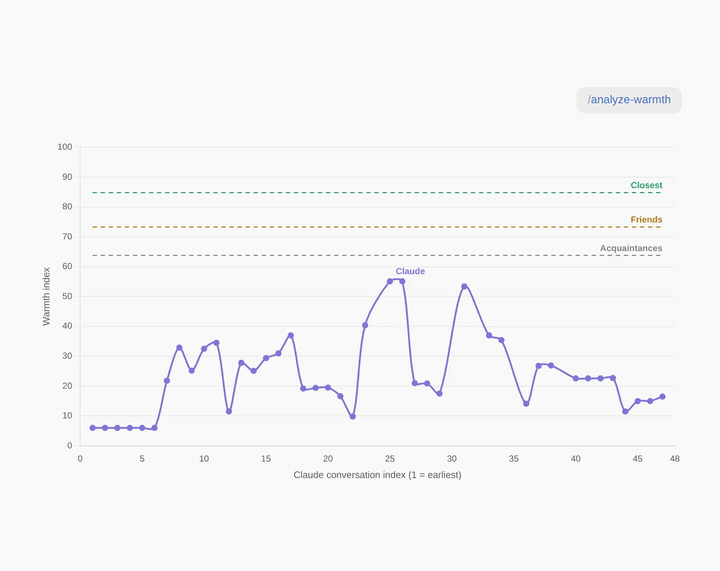

# claude-warmth

Do you treat Claude like a person? **claude-warmth** measures how warmly you write to your AI compared with how you text the actual people in your life — on a 0–100 warmth scale calibrated entirely from your own iMessage history.



It produces two things:

1. **A warmth trend chart** — your warmth toward Claude across your conversation history, plotted against three personal reference lines: how warmly you text your *Acquaintances*, *Friends*, and *Closest* people.
2. **A local HTML report** — the chart, a full plain-language methodology (how the warmth index is defined, how the conversation index works, how the three thresholds are computed), and a clustering view of your contacts by warmth bucket.

Everything runs locally with stdlib Python. No network calls, no uploads, contact numbers masked. Because the scale is calibrated to *your* texting habits, scores aren't comparable between people — by design.

## Requirements

- **macOS with iMessage history** — at least 6 contacts you've sent 100+ messages. You'll copy `~/Library/Messages/chat.db` into your project folder when prompted (the skill walks you through it).
- **Claude usage** — Cowork sessions and/or Claude Code history (`~/.claude/projects`), with at least 16 "deliberative" messages (moments where you think out loud rather than issue commands).
- Claude Cowork or Claude Code.

## Install

**Claude Code:**

```
/plugin marketplace add akestur/claude_warmth
/plugin install claude-warmth@kestur-plugins
```

**Claude Cowork:** Customize menu → Plugins → **+** → Add marketplace → enter `akestur/claude_warmth` → install **claude-warmth**.

## Use

Say:

> analyze my warmth with Claude

or

> do I treat Claude like a person?

## Methodology

### The warmth index

Any batch of messages is scored on ten writing markers, each measured as the percentage of messages containing it: laughter (lol/haha), emoji, profanity, texting slang (u, tbh, idk…), self-disclosure ("i feel", "i miss", "i'm stressed"), hedging ("maybe", "i think"), starting lowercase, and being entirely lowercase — plus two markers that count *against* warmth: ending sentences with a period, and formal politeness ("please", "thank you", "sorry").

Each rate is standardized against your own contacts (z-scored using the mean and spread across them, clamped at ±2.5 so no single feature dominates), then combined as a weighted sum:

| Marker | Weight |
|---|---|
| Laughter | +1.5 |
| Self-disclosure | +1.5 |
| Emoji | +1 |
| Profanity | +1 |
| Texting slang | +1 |
| Entirely lowercase | +0.75 |
| Starts lowercase | +0.75 |
| Hedging | +0.5 |
| Formal politeness | −0.5 |
| Ends with period | −1.5 |

The result is rescaled to 0–100, where **0** is the mathematical floor — a hypothetical writer using none of the warm markers and the maximum of the formal ones — and **100** is your single warmest contact. Question rate and message length are deliberately excluded: prompting an AI inflates both in ways that say nothing about warmth.

### The conversation index

Your Claude conversations are ordered oldest to newest (by timestamp where available — Claude Code sessions carry real timestamps; Cowork sessions are ordered by recency). Only *deliberative* messages are scored: ones where you weigh, decide, or think out loud ("i'm thinking…", "should i…", "what do you think…"), detected by phrase matching. Operator-style commands ("fix the bug", "pull the data") are excluded because they have no analog in human texting and their terse form scores misleadingly.

Because warmth markers are rare events, single messages can't be scored meaningfully. Each point on the chart is a **rolling window** of consecutive deliberative messages (15 when data allows, smaller with sparse data), plotted at the conversation where the window ends. Adjacent points share most of their window — read the arc, not individual wiggles.

### The three threshold lines

Contacts you've sent 100+ messages are ranked by their warmth score and split into thirds: the top third is labeled **Closest**, the middle **Friends**, the bottom **Acquaintances**. Each dashed line sits at the *median* score of its third. The labels are statistical, not social — the ranking measures how casually you write to someone, which usually tracks closeness but can't verify it. A bantering coworker may rank above a parent you text logistics with.

### Honest limitations

The marker weights are judgment calls, not fitted parameters — different reasonable weights shift levels but preserve ordering. The deliberative filter is phrase-based and imperfect. The index measures *style*, not sincerity. Small windows are noisy. And the scale is calibrated to *your* texting habits, so scores are not comparable between people — that's a feature.

## Privacy

Your messages never leave your machine. The analysis scripts are ~400 lines of dependency-free Python you can read in [`plugins/claude-warmth/skills/analyze-warmth/scripts/warmth.py`](plugins/claude-warmth/skills/analyze-warmth/scripts/warmth.py). Reports mask contact identifiers.

## License

MIT
